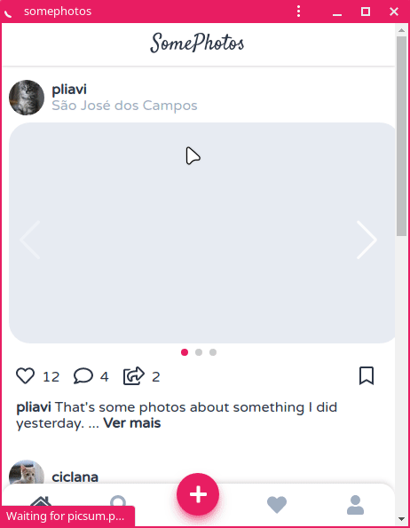

# SomePhotos
## A Instagram clone based on redesigns, made with Vue2, Swiper and Tailwindcss

The redesign images used as base to this project:
 - [Insta redesign by Rafał Staromłyński at Dribbble](https://dribbble.com/shots/6375793-Insta-redesign)
 - [Instagram Redesign UI KIT by Innovation Graphics](https://www.uplabs.com/posts/instagram-redesign-project#)



---

## Run project
This project is made with Vue cli, so, it uses their commands to serve a project?
```
yarn install
yarn serve
```
